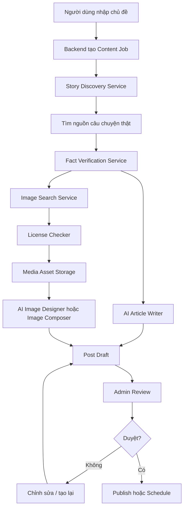
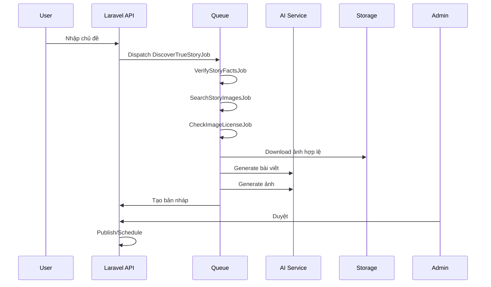

# Tài liệu kỹ thuật: Hệ thống Auto Content “Câu chuyện có thật” + Ảnh Facebook Hook

**Phiên bản:** 1.0  
**Mục tiêu:** Xây dựng phần mềm tự động tìm câu chuyện có thật, lấy ảnh tư liệu thật từ internet, kiểm tra quyền sử dụng ảnh, viết bài Facebook, tạo ảnh bài đăng có text hook và lưu nháp để con người duyệt trước khi đăng.

---

## 1. Mục tiêu sản phẩm

Hệ thống cho phép người dùng nhập một chủ đề hoặc chọn một câu chuyện có thật, ví dụ:

- 33 thợ mỏ Chile được giải cứu sau 69 ngày dưới lòng đất.
- Chú chó Hachiko chờ chủ suốt nhiều năm.
- Máy bay US Airways 1549 hạ cánh xuống sông Hudson.
- Apollo 13 gặp sự cố giữa không gian nhưng vẫn trở về.
- Tàu Endurance mắc kẹt ở Nam Cực.

Sau đó hệ thống tự động:

1. Tìm kiếm câu chuyện thật từ nguồn đáng tin.
2. Lấy ảnh tư liệu thật liên quan đến câu chuyện.
3. Kiểm tra giấy phép/quyền sử dụng ảnh.
4. Sinh bài viết Facebook.
5. Tạo ảnh đăng Facebook dạng 1:1, có text hook lớn.
6. Lưu thành bản nháp.
7. Chờ người duyệt trước khi đăng.

---

## 2. Nguyên tắc quan trọng

### 2.1. Không để AI tự bịa ảnh từ đầu

Sai:

```text
Prompt AI: "Tạo một câu chuyện có thật về người sống sót 9 ngày trong rừng"
```

Lý do sai:

- AI có thể bịa câu chuyện.
- Ảnh có thể ảo, không đúng sự kiện.
- Người xem dễ mất niềm tin.
- Dễ vi phạm nếu mô tả sai người thật/sự kiện thật.

Đúng:

```text
Tìm câu chuyện thật
→ lấy nguồn thật
→ lấy ảnh thật
→ dùng ảnh thật làm nền hoặc tham chiếu
→ thiết kế lại ảnh Facebook
→ sinh bài dựa trên nguồn thật
```

### 2.2. Ảnh phải có nguồn gốc

Mỗi ảnh đưa vào hệ thống phải lưu:

- URL ảnh gốc.
- URL trang chứa ảnh.
- Tên tác giả, nếu có.
- Loại giấy phép.
- Điều kiện sử dụng.
- Ngày tải ảnh.
- Người/hệ thống xác nhận quyền sử dụng.
- Trạng thái: `pending_review`, `approved`, `rejected`.

### 2.3. Không tự động publish ngay

AI chỉ nên tạo:

```text
Bản nháp bài viết + ảnh gợi ý
```

Người thật phải duyệt:

```text
Kiểm tra nội dung
→ kiểm tra ảnh
→ kiểm tra nguồn
→ chỉnh sửa nếu cần
→ bấm đăng
```

---

## 3. Kiến trúc tổng quan



---

## 4. Hai chế độ tạo ảnh

Hệ thống nên hỗ trợ 2 chế độ.

---

### 4.1. Chế độ A: Dùng ảnh thật làm nền và chèn text

Đây là chế độ an toàn nhất nếu ảnh có giấy phép phù hợp.

```text
Ảnh tư liệu thật
→ crop 1:1
→ chỉnh sáng/màu nhẹ
→ thêm gradient/tối nền ở vùng đặt chữ
→ chèn text hook
→ xuất ảnh Facebook
```

Ưu điểm:

- Chân thật nhất.
- Ít sai chi tiết.
- Không bị “ảo”.
- Phù hợp với câu chuyện lịch sử/tư liệu.

Nhược điểm:

- Phụ thuộc chất lượng ảnh gốc.
- Phải kiểm tra bản quyền kỹ.
- Có thể khó tạo bố cục đẹp nếu ảnh gốc không có khoảng trống đặt chữ.

---

### 4.2. Chế độ B: Dùng ảnh thật làm tham chiếu để AI thiết kế lại

```text
3-5 ảnh tư liệu thật
→ AI tạo ảnh poster mới dựa trên reference
→ giữ bối cảnh thật, nhân vật thật, sự kiện thật
→ chèn text hook
```

Ưu điểm:

- Ảnh đẹp, mạnh, dễ viral.
- Bố cục linh hoạt.
- Có thể tối ưu vị trí chữ.

Nhược điểm:

- Có rủi ro AI làm hơi “ảo”.
- Có thể sai chi tiết nhỏ: trang phục, số người, địa điểm.
- Cần human review kỹ trước khi đăng.

Khuyến nghị:

```text
Ưu tiên chế độ A nếu có ảnh thật đủ đẹp và quyền dùng rõ ràng.
Dùng chế độ B khi cần ảnh đẹp hơn nhưng vẫn phải có ảnh thật làm reference.
```

---

## 5. Quy trình nghiệp vụ chi tiết

## 5.1. Bước 1: Người dùng nhập yêu cầu

Ví dụ:

```text
Làm 1 bài Facebook về câu chuyện 33 thợ mỏ Chile.
Ảnh phải thật, không ảo, có text hook giật tít.
```

Hoặc:

```text
Tìm cho tôi 5 câu chuyện có thật về sống sót kỳ diệu.
```

Backend tạo job:

```json
{
  "job_type": "true_story_facebook_post",
  "topic": "33 thợ mỏ Chile",
  "language": "vi",
  "image_mode": "real_photo_or_reference_based",
  "status": "pending"
}
```

---

## 5.2. Bước 2: Tìm câu chuyện thật

Service tìm kiếm phải ưu tiên nguồn:

1. Trang chính thống.
2. Wikipedia/Wikimedia để lấy thông tin tổng quan.
3. Trang cơ quan nhà nước/tổ chức chính thức.
4. NASA nếu là câu chuyện vũ trụ.
5. BBC, Reuters, AP, CNN, Guardian, National Geographic hoặc báo chính thống.
6. Không ưu tiên blog rác, page câu view, website không rõ nguồn.

Kết quả cần lưu:

```json
{
  "story_title": "2010 Copiapó mining accident",
  "short_title_vi": "33 thợ mỏ Chile",
  "event_date": "2010-08-05",
  "rescue_date": "2010-10-13",
  "location": "Mỏ San José, Chile",
  "summary": "33 thợ mỏ bị mắc kẹt dưới lòng đất và được giải cứu sau 69 ngày.",
  "source_urls": [
    "https://..."
  ],
  "fact_status": "verified"
}
```

---

## 5.3. Bước 3: Xác minh sự kiện

Trước khi viết bài, hệ thống cần xác minh tối thiểu:

- Tên sự kiện.
- Thời gian xảy ra.
- Địa điểm.
- Nhân vật chính.
- Con số quan trọng.
- Kết quả cuối cùng.
- Có ít nhất 2 nguồn đáng tin xác nhận.

Ví dụ với thợ mỏ Chile:

```text
- Có 33 thợ mỏ.
- Bị mắc kẹt 69 ngày.
- Vụ việc xảy ra năm 2010.
- Được giải cứu bằng khoang Fénix.
- Không ai thiệt mạng trong nhóm bị mắc kẹt.
```

Không được viết chi tiết nếu không có nguồn xác nhận.

---

## 5.4. Bước 4: Tìm ảnh thật từ internet

Image Search Service cần tìm ảnh theo các truy vấn:

```text
2010 Chile miners rescue photo
Chile miners rescue Fenix capsule
33 Chilean miners rescue image
```

Nên ưu tiên:

- Wikimedia Commons.
- Ảnh từ cơ quan/tổ chức chính thức.
- Ảnh có Creative Commons.
- Ảnh public domain.
- Ảnh từ NASA nếu chủ đề thuộc NASA.
- Ảnh báo chí chỉ dùng nếu có quyền hoặc mua license.

Không nên:

- Lấy bừa từ Google Images.
- Dùng ảnh có watermark.
- Dùng ảnh không rõ nguồn.
- Dùng ảnh của báo lớn nếu chưa có quyền tái sử dụng.
- Dùng ảnh người thật để quảng cáo thương mại khi chưa rõ quyền.

---

## 5.5. Bước 5: Kiểm tra quyền sử dụng ảnh

Mỗi ảnh phải qua `License Checker`.

Các trạng thái đề xuất:

```text
unknown
allowed_public_domain
allowed_creative_commons
allowed_editorial_only
requires_attribution
requires_purchase
rejected
```

Ví dụ metadata cần lưu:

```json
{
  "asset_id": 1001,
  "story_id": 501,
  "source_page_url": "https://commons.wikimedia.org/...",
  "image_url": "https://upload.wikimedia.org/...",
  "license_type": "CC BY-SA 4.0",
  "author": "Tên tác giả",
  "attribution_required": true,
  "commercial_use_allowed": true,
  "modification_allowed": true,
  "license_review_status": "approved",
  "review_note": "Cần ghi nguồn theo CC BY-SA 4.0"
}
```

---

## 5.6. Bước 6: Tải ảnh và lưu media

Không nên hotlink ảnh từ website khác.

Đúng:

```text
Download ảnh
→ lưu vào storage của hệ thống
→ lưu metadata nguồn
→ tạo thumbnail
→ tạo bản crop 1:1
```

Cấu trúc lưu file:

```text
/storage/app/media/true-stories/{story_id}/original/
/storage/app/media/true-stories/{story_id}/processed/
/storage/app/media/true-stories/{story_id}/final/
```

---

## 5.7. Bước 7: Sinh bài viết Facebook

AI Writer nhận dữ liệu đã xác minh, không tự bịa.

Input mẫu:

```json
{
  "story_title": "33 thợ mỏ Chile",
  "verified_facts": [
    "33 thợ mỏ mắc kẹt dưới lòng đất",
    "Thời gian mắc kẹt: 69 ngày",
    "Địa điểm: mỏ San José, Chile",
    "Được giải cứu bằng khoang Fénix"
  ],
  "tone": "cảm xúc, tò mò, dễ đọc, không bịa",
  "platform": "facebook"
}
```

Output mẫu:

```json
{
  "hook": "69 ngày dưới lòng đất – và điều kỳ diệu đã xảy ra.",
  "body": "...",
  "hashtags": ["#CauChuyenCoThat", "#ThoMoChile", "#SongSotKyDieu"],
  "image_headline": "69 NGÀY DƯỚI LÒNG ĐẤT",
  "image_subheadline": "33 THỢ MỎ CHILE ĐƯỢC GIẢI CỨU SỐNG"
}
```

---

## 5.8. Bước 8: Tạo ảnh Facebook

Ảnh đầu ra:

```text
Tỷ lệ: 1:1
Kích thước đề xuất: 1080x1080 hoặc 1200x1200
Định dạng: JPG/PNG/WebP
```

Yêu cầu:

- Có ảnh thật hoặc ảnh thiết kế lại từ ảnh thật.
- Text rõ trên mobile.
- Không quá nhiều chữ.
- Không che mặt nhân vật chính.
- Không sai chính tả tiếng Việt.
- Có nhãn “CÂU CHUYỆN CÓ THẬT”.

---

## 6. Prompt chuẩn cho AI thiết kế ảnh

### 6.1. Prompt chung

```text
Tạo ảnh vuông tỷ lệ 1:1 để đăng Facebook.

Chủ đề là câu chuyện có thật: {story_name}

Yêu cầu bắt buộc:
- Phải dựa trên ảnh tư liệu thật từ internet về câu chuyện này.
- Các ảnh tham chiếu được cung cấp là ảnh thật của sự kiện.
- Hãy dùng ảnh tham chiếu để bám sát bối cảnh, nhân vật, trang phục, đồ vật, màu sắc và không khí thực tế.
- Không được tự tưởng tượng hoàn toàn.
- Không được làm ảnh fantasy, hoạt hình, tranh vẽ, siêu thực.
- Không dùng hiệu ứng cháy nổ quá đà.
- Hình ảnh phải giống ảnh phóng sự / ảnh báo chí / documentary.
- Có thể thiết kế lại bố cục cho đẹp hơn, nhưng vẫn phải tạo cảm giác đáng tin.
- Không logo, không watermark.

Bố cục:
- Một phần ảnh là khoảnh khắc thật, cảm xúc thật của sự kiện.
- Một phần dành cho text hook lớn.
- Text phải rõ, to, dễ đọc trên điện thoại.
- Không che mất khuôn mặt/cảm xúc chính.

Text trên ảnh:
- Nhãn trên cùng: “CÂU CHUYỆN CÓ THẬT”
- Tiêu đề chính: “{headline}”
- Dòng phụ: “{subheadline}”

Phong cách chữ:
- Font đậm kiểu báo chí.
- Màu trắng/vàng/đỏ.
- Có bóng đổ hoặc nền tối nhẹ để dễ đọc.
- Tổng thể giống ảnh bìa bài Facebook về câu chuyện có thật.
```

---

### 6.2. Prompt ví dụ: Thợ mỏ Chile

```text
Tạo ảnh vuông tỷ lệ 1:1 để đăng Facebook, dựa trên câu chuyện có thật về vụ giải cứu 33 thợ mỏ Chile năm 2010.

Các ảnh tham chiếu được cung cấp là ảnh thật của sự kiện. Hãy dùng chúng để bám sát bối cảnh, khoang cứu hộ, mũ bảo hộ, trang phục cứu hộ, không khí mỏ và khoảnh khắc các thợ mỏ được giải cứu.

Phong cách:
- Ảnh phóng sự, ảnh báo chí, documentary.
- Chân thật, không ảo, không fantasy.
- Không làm quá điện ảnh.
- Không hiệu ứng cháy nổ.
- Ánh sáng giống đèn cứu hộ và flash máy ảnh tại hiện trường.
- Khuôn mặt nhân vật có bụi, mồ hôi, xúc động nhưng tự nhiên.

Bố cục:
- Bên trái có khoang cứu hộ Fénix.
- Bên phải hoặc giữa có nhóm thợ mỏ đội mũ bảo hộ đang ôm nhau vui mừng.
- Hậu cảnh có vách đá, nhân viên cứu hộ, đèn pin, thiết bị cứu hộ.
- Chừa khoảng trống rõ để đặt chữ.

Text:
- Nhãn đỏ phía trên: “CÂU CHUYỆN CÓ THẬT”
- Tiêu đề chính thật lớn: “69 NGÀY DƯỚI LÒNG ĐẤT”
- Dòng phụ phía dưới: “33 THỢ MỎ CHILE ĐƯỢC GIẢI CỨU SỐNG”

Thiết kế chữ:
- Font đậm, dễ đọc.
- Màu trắng chủ đạo, có texture bụi nhẹ.
- Có bóng đổ/nền tối nhẹ sau chữ.
- Không che mất cảm xúc khuôn mặt nhân vật.
```

---

## 7. Prompt chuẩn cho AI viết bài Facebook

```text
Bạn là biên tập viên nội dung Facebook.

Hãy viết bài Facebook bằng tiếng Việt dựa trên câu chuyện có thật sau.

Yêu cầu:
- Chỉ dùng các sự kiện đã được xác minh.
- Không bịa lời thoại, không bịa cảm xúc cụ thể nếu nguồn không nói.
- Văn phong cảm xúc, dễ đọc, có nhịp kể chuyện.
- Mở bài phải có hook mạnh.
- Không viết quá dài.
- Có chia đoạn ngắn.
- Có CTA nhẹ ở cuối.
- Không giật tít sai sự thật.
- Không dùng từ ngữ phản cảm.
- Nếu có con số, phải đúng với dữ kiện được cung cấp.

Dữ kiện đã xác minh:
{verified_facts}

Nguồn tham khảo:
{source_urls}

Yêu cầu đầu ra JSON:
{
  "facebook_post": "...",
  "short_hook": "...",
  "image_headline": "...",
  "image_subheadline": "...",
  "hashtags": []
}
```

---

## 8. Data model đề xuất

## 8.1. Bảng `true_stories`

```sql
CREATE TABLE true_stories (
    id BIGINT PRIMARY KEY AUTO_INCREMENT,
    title VARCHAR(255) NOT NULL,
    title_vi VARCHAR(255),
    slug VARCHAR(255) UNIQUE,
    summary TEXT,
    event_date DATE NULL,
    location VARCHAR(255),
    status ENUM('draft', 'verified', 'rejected') DEFAULT 'draft',
    fact_review_status ENUM('pending', 'approved', 'rejected') DEFAULT 'pending',
    created_at TIMESTAMP NULL,
    updated_at TIMESTAMP NULL
);
```

---

## 8.2. Bảng `story_sources`

```sql
CREATE TABLE story_sources (
    id BIGINT PRIMARY KEY AUTO_INCREMENT,
    story_id BIGINT NOT NULL,
    source_url TEXT NOT NULL,
    source_title VARCHAR(500),
    source_type ENUM('official', 'news', 'wiki', 'archive', 'other') DEFAULT 'other',
    trust_score TINYINT DEFAULT 0,
    extracted_facts JSON NULL,
    created_at TIMESTAMP NULL,
    updated_at TIMESTAMP NULL
);
```

---

## 8.3. Bảng `media_assets`

```sql
CREATE TABLE media_assets (
    id BIGINT PRIMARY KEY AUTO_INCREMENT,
    story_id BIGINT NOT NULL,
    source_page_url TEXT,
    image_url TEXT,
    local_original_path TEXT,
    local_processed_path TEXT,
    license_type VARCHAR(255),
    license_url TEXT,
    author VARCHAR(255),
    attribution_text TEXT,
    attribution_required BOOLEAN DEFAULT FALSE,
    commercial_use_allowed BOOLEAN DEFAULT FALSE,
    modification_allowed BOOLEAN DEFAULT FALSE,
    license_review_status ENUM('pending', 'approved', 'rejected') DEFAULT 'pending',
    review_note TEXT,
    created_at TIMESTAMP NULL,
    updated_at TIMESTAMP NULL
);
```

---

## 8.4. Bảng `content_jobs`

```sql
CREATE TABLE content_jobs (
    id BIGINT PRIMARY KEY AUTO_INCREMENT,
    job_type VARCHAR(100) NOT NULL,
    input_payload JSON,
    status ENUM('pending', 'running', 'completed', 'failed') DEFAULT 'pending',
    error_message TEXT NULL,
    started_at TIMESTAMP NULL,
    finished_at TIMESTAMP NULL,
    created_at TIMESTAMP NULL,
    updated_at TIMESTAMP NULL
);
```

---

## 8.5. Bảng `generated_posts`

```sql
CREATE TABLE generated_posts (
    id BIGINT PRIMARY KEY AUTO_INCREMENT,
    story_id BIGINT NOT NULL,
    content_job_id BIGINT,
    platform ENUM('facebook', 'website', 'instagram') DEFAULT 'facebook',
    post_body TEXT,
    hook VARCHAR(500),
    image_headline VARCHAR(255),
    image_subheadline VARCHAR(255),
    hashtags JSON,
    status ENUM('draft', 'approved', 'published', 'rejected') DEFAULT 'draft',
    created_at TIMESTAMP NULL,
    updated_at TIMESTAMP NULL
);
```

---

## 8.6. Bảng `generated_images`

```sql
CREATE TABLE generated_images (
    id BIGINT PRIMARY KEY AUTO_INCREMENT,
    story_id BIGINT NOT NULL,
    generated_post_id BIGINT NULL,
    mode ENUM('real_photo_overlay', 'ai_reference_based') NOT NULL,
    prompt TEXT,
    reference_asset_ids JSON,
    output_path TEXT,
    text_overlay JSON,
    status ENUM('draft', 'approved', 'rejected') DEFAULT 'draft',
    review_note TEXT,
    created_at TIMESTAMP NULL,
    updated_at TIMESTAMP NULL
);
```

---

## 9. API endpoints đề xuất

### 9.1. Tạo job mới

```http
POST /api/true-story/jobs
```

Body:

```json
{
  "topic": "33 thợ mỏ Chile",
  "platform": "facebook",
  "language": "vi",
  "image_mode": "real_photo_overlay"
}
```

Response:

```json
{
  "job_id": 123,
  "status": "pending"
}
```

---

### 9.2. Lấy danh sách câu chuyện đã tìm được

```http
GET /api/true-stories
```

---

### 9.3. Xem chi tiết câu chuyện

```http
GET /api/true-stories/{id}
```

---

### 9.4. Xem ảnh tư liệu của câu chuyện

```http
GET /api/true-stories/{id}/media-assets
```

---

### 9.5. Duyệt ảnh tư liệu

```http
POST /api/media-assets/{id}/approve
```

Body:

```json
{
  "license_review_status": "approved",
  "review_note": "Ảnh từ Wikimedia Commons, cần ghi nguồn."
}
```

---

### 9.6. Tạo bài viết Facebook

```http
POST /api/true-stories/{id}/generate-post
```

---

### 9.7. Tạo ảnh Facebook

```http
POST /api/true-stories/{id}/generate-image
```

Body:

```json
{
  "mode": "real_photo_overlay",
  "asset_id": 1001,
  "headline": "69 NGÀY DƯỚI LÒNG ĐẤT",
  "subheadline": "33 THỢ MỎ CHILE ĐƯỢC GIẢI CỨU SỐNG"
}
```

---

### 9.8. Duyệt bản nháp

```http
POST /api/generated-posts/{id}/approve
```

---

### 9.9. Đăng bài

```http
POST /api/generated-posts/{id}/publish
```

---

## 10. Queue jobs đề xuất

Nên chạy bằng queue để tránh request timeout.

```text
DiscoverTrueStoryJob
VerifyStoryFactsJob
SearchStoryImagesJob
CheckImageLicenseJob
DownloadMediaAssetJob
GenerateFacebookPostJob
GenerateFacebookImageJob
CreateDraftPostJob
PublishPostJob
```

Luồng queue:



---

## 11. Service layer đề xuất

```text
app/Services/TrueStory/
├── StoryDiscoveryService.php
├── StoryFactVerificationService.php
├── StoryImageSearchService.php
├── LicenseCheckerService.php
├── MediaDownloadService.php
├── ArticleWriterService.php
├── ImagePromptBuilderService.php
├── ImageComposerService.php
├── PostDraftService.php
└── PublishingService.php
```

---

## 12. Cách tích hợp AI

### 12.1. AI viết bài

Có thể dùng:

- Claude API.
- OpenAI API.
- Gemini API.

AI chỉ nhận dữ kiện đã xác minh.

Không để AI tự search nếu hệ thống chưa lưu nguồn.

Đúng:

```text
Backend search nguồn
→ backend trích xuất facts
→ backend gửi facts cho AI viết bài
```

Sai:

```text
Gửi mỗi câu “viết bài về thợ mỏ Chile” rồi để AI tự bịa mọi thứ
```

---

### 12.2. AI tạo ảnh

Có 2 lựa chọn:

#### Lựa chọn 1: AI image model

Dùng ảnh thật làm reference, sau đó tạo poster.

#### Lựa chọn 2: Image composer tự code

Dùng thư viện xử lý ảnh:

- PHP: Intervention Image.
- Node.js: Sharp.
- Python: Pillow.
- Frontend editor: Fabric.js / Konva.js.

Luồng:

```text
Ảnh thật
→ crop
→ thêm overlay tối
→ chèn headline
→ chèn subheadline
→ xuất PNG/JPG
```

Với yêu cầu ảnh không ảo, nên ưu tiên **Image Composer tự code**.

---

## 13. Nên dùng API hay app Claude?

Không nên dùng cookies/extension để điều khiển Claude app.

Lý do:

- Dễ lỗi khi giao diện Claude thay đổi.
- Dễ lộ session/cookies.
- Khó log request/response.
- Khó scale cho nhiều người dùng.
- Khó kiểm soát chi phí.
- Không phù hợp sản phẩm nghiêm túc.

Nên dùng API chính thức:

```text
Laravel
→ AI API
→ nhận JSON
→ lưu database
→ duyệt
→ publish
```

---

## 14. Kiểm duyệt nội dung

Trước khi đăng, cần có màn hình review.

Reviewer cần xem:

- Bài viết có đúng sự thật không?
- Số liệu có đúng không?
- Ảnh có đúng sự kiện không?
- Ảnh có quyền sử dụng không?
- Text trên ảnh có sai chính tả không?
- Có gây hiểu nhầm không?
- Có đang lợi dụng hình ảnh nạn nhân/người thật quá mức không?

Trạng thái review:

```text
draft
needs_revision
approved
scheduled
published
rejected
```

---

## 15. Checklist chất lượng ảnh

Ảnh đạt yêu cầu khi:

```text
[ ] Tỷ lệ 1:1
[ ] Có ảnh tư liệu thật làm nền hoặc reference
[ ] Không quá ảo
[ ] Không fantasy
[ ] Text tiếng Việt đúng chính tả
[ ] Chữ rõ trên điện thoại
[ ] Không che mặt nhân vật chính
[ ] Có nhãn “CÂU CHUYỆN CÓ THẬT”
[ ] Có headline mạnh
[ ] Có subheadline rõ
[ ] Có nguồn ảnh và license
[ ] Được duyệt bởi người thật
```

---

## 16. Checklist chất lượng bài viết

Bài viết đạt yêu cầu khi:

```text
[ ] Có hook mở đầu mạnh
[ ] Câu chuyện có nguồn thật
[ ] Không bịa nhân vật/lời thoại
[ ] Không sai số liệu
[ ] Văn phong dễ đọc
[ ] Chia đoạn ngắn
[ ] Có cảm xúc nhưng không lố
[ ] Có CTA nhẹ
[ ] Có hashtag phù hợp
[ ] Được duyệt trước khi đăng
```

---

## 17. Ví dụ output hoàn chỉnh

### 17.1. Ảnh

```json
{
  "headline": "69 NGÀY DƯỚI LÒNG ĐẤT",
  "subheadline": "33 THỢ MỎ CHILE ĐƯỢC GIẢI CỨU SỐNG",
  "label": "CÂU CHUYỆN CÓ THẬT",
  "image_mode": "real_photo_overlay",
  "output_path": "/storage/media/true-stories/501/final/chile-miners-facebook.jpg"
}
```

### 17.2. Bài Facebook

```text
69 ngày dưới lòng đất.

Không ánh mặt trời.
Không biết ngày mai có còn sống không.
Và phía trên mặt đất, cả thế giới gần như nín thở.

Năm 2010, 33 thợ mỏ tại Chile bị mắc kẹt sau một vụ sập mỏ. Họ phải sống trong điều kiện khắc nghiệt, chờ đợi từng tín hiệu cứu hộ từ bên ngoài.

Điều kỳ diệu là sau 69 ngày, tất cả 33 người đều được đưa trở về.

Đây không chỉ là một cuộc giải cứu.
Đây là câu chuyện về niềm tin, ý chí và sức mạnh của con người khi bị đẩy đến tận cùng.

Bạn còn nhớ câu chuyện này không?

#CauChuyenCoThat #ThoMoChile #SongSotKyDieu
```

---

## 18. Rủi ro cần tránh

### 18.1. Rủi ro bản quyền ảnh

Không được giả định rằng ảnh trên Google là được dùng tự do.

Cần lưu:

```text
license_type
license_url
author
source_url
attribution_text
```

### 18.2. Rủi ro AI hallucination

AI có thể:

- Bịa số liệu.
- Bịa lời thoại.
- Gắn nhầm ảnh sự kiện khác.
- Viết quá cảm xúc làm sai sự thật.

Cách giảm rủi ro:

```text
Chỉ cho AI dùng verified_facts
Bắt AI trả JSON có field nguồn
Review thủ công
Không auto publish
```

### 18.3. Rủi ro ảnh quá ảo

Cách giảm:

```text
Dùng ảnh thật làm nền
Hoặc dùng reference thật
Prompt bắt buộc: documentary, photojournalism, realistic
Cấm fantasy, cinematic overdone, illustration
Human review
```

### 18.4. Rủi ro dùng cookies/extension

Không dùng cookies để điều khiển app AI.

Nên dùng API chính thức.

---

## 19. Gợi ý giao diện admin

Màn hình danh sách job:

```text
Tên câu chuyện | Trạng thái fact | Trạng thái ảnh | Trạng thái bài | Người duyệt | Ngày tạo
```

Màn hình chi tiết:

```text
1. Thông tin câu chuyện
2. Nguồn xác minh
3. Ảnh tư liệu tìm được
4. License từng ảnh
5. Bài viết AI sinh
6. Ảnh Facebook AI sinh
7. Nút tạo lại
8. Nút duyệt
9. Nút đăng/lên lịch
```

---

## 20. Thang điểm tự động đề xuất

Mỗi bài có thể tính điểm trước khi đưa duyệt:

```text
fact_score: 0-100
image_realism_score: 0-100
license_score: 0-100
text_readability_score: 0-100
click_hook_score: 0-100
risk_score: 0-100
```

Quy tắc:

```text
Nếu license_score < 80 → không cho đăng.
Nếu fact_score < 80 → không cho đăng.
Nếu image_realism_score < 70 → yêu cầu tạo lại ảnh.
Nếu risk_score > 60 → bắt buộc review cấp cao.
```

---

## 21. Công nghệ đề xuất

### Backend

```text
Laravel
MySQL
Redis Queue
Laravel Horizon
S3-compatible storage hoặc local storage
```

### Frontend admin

```text
Vue 3 hoặc Next.js
TailwindCSS
Image preview/editor
```

### AI

```text
Claude/OpenAI/Gemini cho viết nội dung
OpenAI Images/Imagen/Stability hoặc công cụ tương đương cho ảnh reference-based
ImageMagick/Sharp/Pillow/Intervention Image cho chèn text lên ảnh thật
```

### Search

```text
Google Custom Search API
Bing Search API
SerpAPI
Wikimedia API
NASA Image API nếu cần
```

---

## 22. MVP nên làm trước

Không nên làm quá lớn ngay từ đầu.

MVP đề xuất:

```text
1. Admin nhập tên câu chuyện.
2. Dev/hệ thống tìm nguồn và ảnh thủ công/bán tự động.
3. Upload ảnh thật vào hệ thống.
4. AI viết bài Facebook từ dữ kiện đã nhập.
5. Hệ thống chèn text lên ảnh thật bằng Image Composer.
6. Lưu bản nháp.
7. Người duyệt rồi đăng.
```

Sau khi MVP ổn mới mở rộng:

```text
- Tự search câu chuyện.
- Tự search ảnh.
- Tự kiểm tra license.
- Tự tạo nhiều version ảnh.
- A/B test hook.
- Tự schedule bài.
```

---

## 23. Kết luận triển khai

Cách làm đúng cho phần mềm auto là:

```text
Không dùng AI để bịa ảnh.
Không lấy ảnh Google bừa bãi.
Không dùng cookies/extension để điều khiển app AI.

Phải:
Tìm câu chuyện thật
→ xác minh nguồn
→ lấy ảnh thật
→ kiểm tra quyền dùng ảnh
→ tạo bài
→ tạo ảnh có hook
→ lưu nháp
→ người duyệt
→ đăng
```

Đây là hướng an toàn hơn, đáng tin hơn và phù hợp để phát triển thành sản phẩm lâu dài.

---

## 24. Nguồn tham khảo kỹ thuật/pháp lý

- Google Search Help: Find images you can use & share  
  https://support.google.com/websearch/answer/29508

- Wikimedia Commons: Reusing content outside Wikimedia  
  https://commons.wikimedia.org/wiki/Commons:Reusing_content_outside_Wikimedia

- NASA: Guidelines for using NASA Images and Media  
  https://www.nasa.gov/nasa-brand-center/images-and-media/

- Anthropic Claude API: Tool use overview  
  https://platform.claude.com/docs/en/agents-and-tools/tool-use/overview
